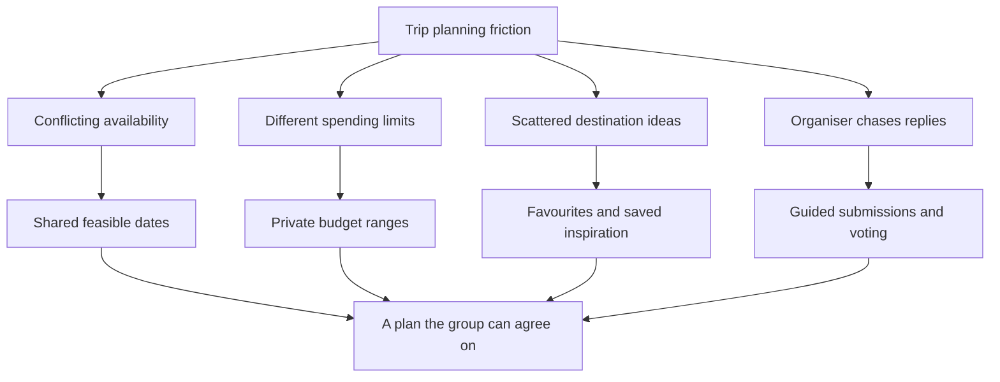
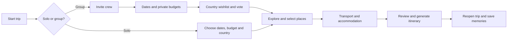

# CutiSama2 by Starstruck

**Team:** Brendan Chia Yan Fei, Neo Li Xin, Chew Chiu Xian  
**Problem Statement:** Travel Planner  
**Video Presentation:** To add — unlisted YouTube link  
**Presentation Slides:** To add — public link

> From “where should we go?” to a trip everyone can agree on.

## 1. Project Overview

### The Problem

Planning a trip involves more than finding attractive destinations. Friends must agree on dates, interests and spending limits, often across scattered messages and saved posts. One organiser ends up chasing replies and combining conflicting preferences, while travellers may feel uncomfortable revealing how much they can afford. Solo travellers face the same research and budgeting work without someone to share it.

Our target users are students, budget-conscious travellers and friend groups. The stakeholders are both the organiser coordinating decisions and the participants whose availability, interests and financial limits determine whether the plan works.

### Our Solution

CutiSama2 turns travel planning into a guided quest: agree on dates, set private budgets, choose countries, vote, explore places and arrange logistics. Everyone contributes through a shared process, while the organiser confirms key decisions. Solo mode removes group voting so independent travellers can plan directly. Personal profiles, favourite places, saved inspiration and trip history give travellers reasons to return for their next adventure.

### Feature Set

These features are represented in the repository; live availability depends on the matching backend migrations, services and configuration.

| Feature | What travellers can do |
| --- | --- |
| Group planning quest | Submit availability, nominate countries and vote before the organiser confirms shared decisions. |
| Private budget ranges | Set comfortable spending and an absolute maximum in MYR without exposing individual amounts to the group. |
| Solo trips | Choose dates and a destination directly, without waiting for group submissions or votes. |
| Personalisation and favourites | Save a display name, profile picture and up to 30 favourite places. |
| Personal account settings | Start with an anonymous identity and access account settings to retain a personal travel identity. |
| Saved inspiration | Save travel posts, review extracted places and explicitly confirm locations to use in a trip. Media analysis requires its configured worker. |
| Maps and attraction choices | Explore destination attractions and contribute places to the shared plan. |
| Logistics and AI planning | Record transport, compare stays and generate a draft itinerary using the trip's constraints. Estimates are not live booking quotes. |
| Trips and memories | Reopen saved trips and access completed-trip memories from the profile. |
| Invitations and discovery | Invite friends and access public-trip discovery and listing controls. Joining is subject to trip eligibility and membership rules. |

Favourite places are currently saved profile data; this does not imply that every recommendation automatically uses them. Saved inspiration has a separate, explicit place-import flow.

### What Makes the Algorithm Different?

The core is a transparent decision process, with AI assisting within validated constraints.

1. **Find feasible dates.** Intersect participants' availability and construct valid travel windows. AI may rank those candidates; calendar ranking provides a labelled fallback.
2. **Protect affordability.** The group comfort ceiling is the lowest comfortable budget; the hard ceiling is the lowest maximum. Individual submissions remain private.
3. **Choose fairly.** Deduplicate nominated countries and give each participant an agree/pass vote per country. Reveal results after everyone finishes. The highest positive vote count wins; the organiser resolves a tie, and an all-pass result reopens nominations.
4. **Account for logistics.** Deduct each traveller's selected transport and shared accommodation costs. Use the lowest remaining amount for shared activities instead of an average that could leave someone behind.
5. **Generate within constraints.** Validate structured AI output against the trip's dates, destination and budget. Missing logistics produce a provisional draft.

**Example:** If three travellers set comfortable budgets of RM 800, RM 1,000 and RM 1,200, the group comfort ceiling is RM 800. If their maximums are RM 1,000, RM 1,400 and RM 1,500, the hard ceiling is RM 1,000. A RM 900 estimate is a stretch; RM 1,100 exceeds the shared limit.

The judges suggested Gemini for budget recommendations. The current quest documentation uses Groq for date ranking, and the budget service uses a configured AI provider. Travellers determine their own limits; AI estimates costs rather than deciding what they can afford. See [quest mechanics](docs/trip-quest.md) and [saved inspiration](docs/saved-inspiration.md).

### Competitive Market

| Alternative | Existing strengths | CutiSama2's intended focus |
| --- | --- | --- |
| [Wanderlog](https://wanderlog.com/) | Itinerary planning, maps, collaboration, budgeting and AI assistance. | Guided group agreement, private comfort/hard budget ranges and explicit voting rules. |
| Group chats and separate saved-place lists | Familiar tools for discussing ideas and collecting inspiration. | Bring submissions, decisions and the resulting plan into one repeatable flow. |

Wanderlog already offers [budget tracking and expense splitting](https://wanderlog.com/travel-budget-expense-splitting-app), so “AI travel planner” or “group budgeting” alone is not a convincing distinction. Our hypothesis is that collecting everyone's constraints before finalising a destination reduces coordination work. This is a positioning hypothesis, not evidence that competitors lack equivalent capabilities or that users will switch.

### Will People Keep Using It?

Favourite places and saved inspiration provide value before a trip; saved plans and memories provide value afterwards. Solo mode makes the app useful even when friends are unavailable. These support repeat use, but adoption and retention still need validation.

**Proposed validation:** Ask student and friend groups to plan a real trip, compare time to agreement with their usual method, record where participants abandon the flow, and check whether they return to plan another trip. Track AI cost per completed plan and repeat usage to assess operating sustainability. No user-study results or market-size claims are asserted here.

## 2. Ideation & Process

### 2.1 Ideas We Considered

This table summarises the current implementation and directions raised by the judges. It is not a complete historical brainstorming record; the team should add any other original ideas before submission.

| Idea | Why it was dropped / kept |
| --- | --- |
| Guided group planning quest (Chosen) | Gives the organiser and participants a shared sequence of decisions. |
| Private budget ranges (Chosen) | Makes affordability part of planning without identifying the lowest-budget traveller. |
| Solo planning (Chosen) | Extends usefulness beyond group trips and skips unnecessary voting. |
| Profiles, favourite places and saved inspiration (Chosen) | Lets travellers keep personal ideas between trips. |
| Previous trips and memories (Chosen) | Supports returning users and continuity after a trip ends. |
| Invitations and public discovery (Chosen) | Supports existing friends and discoverable trips, subject to joining rules. |
| AI assistance with validated constraints (Chosen) | Helps with suggestions while keeping key decisions explainable. |
| Gemini specifically for budgeting (Suggested; not confirmed as selected) | The underlying need is useful cost estimates; provider choice is separate from user-controlled spending limits. |
| Automatic personalisation from all favourites (Future evaluation) | Saving favourites exists; broader recommendation integration needs explicit design and validation. |

### 2.2 Ideation Boards

The diagrams below are reconstructed explanations of the current concept, not original workshop artefacts. Add the team's actual sketches or board links when available.



This problem-to-solution map connects coordination difficulties to the features intended to address them.



This flow shows the shared planning journey and where solo travellers skip group coordination.

### 2.3 Mentor Consultation

The following feedback was discussed with Jeremy Lau Wei Han on 7 September 2026. Existing features are noted as responses to the feedback.

| Date | Mentor | Feedback Received | What Was Changed |
| --- | --- | --- | --- |
| 7 September 2026 | Jeremy Lau Wei Han | Add favourites, personalisation and accounts. | README now explains profile favourites, identity and saved inspiration, including the limits of automatic personalisation. |
| 7 September 2026 | Jeremy Lau Wei Han | Consider solo trips. | README now describes the existing solo flow and skipped voting steps. |
| 7 September 2026 | Jeremy Lau Wei Han | View previous trips; consider longevity and whether people will use it. | Added trips and memories, repeat-use rationale and a proposed validation plan. |
| 7 September 2026 | Jeremy Lau Wei Han | Allow friends and public joining. | Documented invitation and discovery features with eligibility constraints. |
| 7 September 2026 | Jeremy Lau Wei Han | Highlight the algorithm; consider Gemini for budget recommendations. | Added decision rules, an affordability example and the distinction between AI estimates and personal spending limits. |
| 7 September 2026 | Jeremy Lau Wei Han | Include competitive analysis and a clearer problem statement. | Added target stakeholders and a sourced comparison with Wanderlog. |
| 7 September 2026 | Jeremy Lau Wei Han | Too much text; avoid repetitive organiser/participant demonstrations. | Reorganised the README into compact tables and diagrams; added the single-journey demo below. Presentation changes remain to be made. |

## 3. Design & Prototype

**UI Prototype:** [ Public Link ]

Check that it opens in an incognito window. This can be a link to Figma, Canva, Netlify, Vercel or any other board where you showcase your UI. It can be clickable with hyperlinks or simply ordered screenshots.

We recommend you embed or link 4–8 key screens as images, with a caption on each explaining the interaction

## 4. What Makes It Different

CutiSama2 combines structured group decision-making with personal travel continuity. Its distinctive features are:

| Feature | What makes it different |
| --- | --- |
| Private comfort and maximum budgets | Participants contribute real limits without exposing individual amounts. The group plan uses the lowest comfort and maximum ceilings so the itinerary remains affordable for everyone. |
| Guided planning quest | Dates, budgets, destinations, attractions and logistics are completed as clear stages. This reduces organiser chasing and makes progress visible. |
| Explainable destination selection | Country nominations are deduplicated, each participant gets one vote per country, results reveal after everyone votes, and ties follow a documented organiser rule. |
| Solo mode | A solo traveller can use the same planning foundation without unnecessary group invitations or voting. |
| Personal travel passport | Profiles, favourite places, saved inspiration, previous trips and memories make the product useful between trips. |
| AI within validated rules | AI ranks or estimates options, while deterministic checks enforce dates, budgets, destination constraints and privacy. |
| Confirmed place import | Travellers can bring places from saved inspiration into a trip, then explicitly confirm what becomes part of the shared plan. |

Compared with general itinerary tools, the twist is that CutiSama2 makes agreement and affordability first-class decisions before generating a plan.

## 5. Technical Architecture & Feasibility

### Tech stack

| Layer | Technology | Why it was chosen and expected constraints |
| --- | --- | --- |
| Frontend | Expo SDK 57, Expo Router, React Native, TypeScript | One codebase for mobile and web with typed navigation and shared components. Native-device testing and platform-specific behaviour remain constraints. |
| Backend | Supabase Auth, Edge Functions and RPC/database functions | Managed authentication and server-side workflows reduce infrastructure work. Function cold starts, deployment configuration and provider limits remain constraints. |
| Database | Supabase PostgreSQL with Row Level Security and Realtime | Relational trip state, private participant inputs and secure per-user access fit the data model. Realtime is used for notifications; clients still refetch authorised state. |
| Validation | Zod contracts and deterministic domain rules | Keeps mobile and server payloads aligned and prevents malformed or contradictory generated plans from being stored. Contracts must be updated across app and functions together. |
| AI services | Configured Groq/OpenAI-compatible planning provider and OpenAI saved-inspiration analysis | AI assists with ranking, estimates and media extraction while server-side secrets stay private. Provider latency, cost, rate limits and imperfect estimates require fallbacks and validation. |
| Maps | OpenStreetMap raster tiles | No additional map API key is required for the prototype. Tile usage must follow the OpenStreetMap policy and fresh imagery needs a network connection. |
| Testing | Jest, React Native Testing Library, pgTAP, Deno and Maestro | Covers app logic, contracts, database rules, Edge Functions and user flows. Live provider, realtime and native-device behaviour still need deployment testing. |
| Hosting | Expo-compatible build/runtime and a hosted Supabase project | Keeps the prototype deployable with managed services. Production hosting, secrets, quotas and release configuration must be maintained separately. |

### System architecture diagram

The text diagram is stored at [`images/system-architecture.md`](images/system-architecture.md) and can be converted into a visual diagram for the final submission.

### Build plan & scope

The build phase focuses on a demonstrable end-to-end path:

1. Create or enter a trip as a solo traveller or group organiser.
2. Collect availability and private comfort/maximum budgets.
3. Select and vote on destinations, then explore attractions on the map.
4. Add transport and accommodation estimates and review the remaining budget.
5. Generate a constrained draft itinerary and show its assumptions clearly.
6. Save the trip, reopen it from trip history and show favourite places or saved inspiration.

The scope excludes live booking, payment processing, guaranteed prices, turn-by-turn navigation and a full social network. Booking links open external providers. These boundaries keep the prototype feasible while demonstrating the core value: helping travellers reach an affordable, explainable plan together.
## Demo Plan

Use one trip across two prepared sessions instead of repeating the whole journey for each role.

1. **Set the problem:** Friends want a trip but have different dates, interests and budgets.
2. **Show personalisation:** Open a traveller's favourite places or saved inspiration.
3. **Create once:** The organiser opens a group trip; a participant joins and submits preferences. Use prepared submissions for the remaining crew.
4. **Show the decision:** Reveal country votes and explain the private budget ceilings with one numerical example.
5. **Show the outcome:** Select places, review logistics and open the generated itinerary. Distinguish estimated costs from confirmed bookings.
6. **Close the loop:** Reopen the trip from history and briefly show that solo mode skips voting.

Keep the presentation focused on one problem, the decision mechanism and the resulting plan. Use screenshots and the flow diagram to support the live demo; prepare a recording if network-dependent services are unavailable.

## Developer Setup

<details>
<summary>Expand technical stack, setup, verification and project structure</summary>

## Technical stack

- Expo SDK 57 and Expo Router
- React 19.2 and React Native 0.86
- TypeScript 6
- React Native Gesture Handler and Reanimated
- Supabase Auth, Postgres, Row Level Security, Realtime, and Edge Functions
- Zod contracts shared across the app and backend
- Groq structured output for optional reveal wording, itinerary generation, and bounded revisions
- Jest, React Native Testing Library, pgTAP, Deno tests, and Maestro

## Reliability and privacy

- Anonymous identities persist in secure device storage and have an explicit recovery path when an identity is lost.
- Room data is cached for offline recovery and refreshed from the authoritative backend after reconnecting.
- Realtime broadcasts carry only scoped identifiers; clients refetch RLS-protected state after receiving an event.
- Preference choices stay private during collection and are returned only after reveal.
- Accessibility requirements remain private unless the member explicitly consents to group attribution.
- Mutating workflows use persistent idempotency keys to prevent duplicate submissions and generated versions.
- Group-match facts are deterministic and source-linked. AI can rewrite display prose but cannot create new conclusions.
- Generated itineraries are schema checked and rejected when they conflict with locked destinations, hard constraints, provenance, or privacy rules.

## Requirements

- Node.js 22.13 or later
- npm
- Android Studio, Xcode, or an Expo-compatible device
- A Supabase project with Anonymous Sign-Ins enabled
- Supabase CLI and Docker for local database tests
- Deno for Edge Function tests
- Maestro for end-to-end mobile tests

## Configure the app

1. Install dependencies:

   ```text
   npm install
   ```

2. Copy `.env.example` to `.env`.

3. Set the public Expo variables:

   ```text
   EXPO_PUBLIC_SUPABASE_URL=https://your-project.supabase.co
   EXPO_PUBLIC_SUPABASE_PUBLISHABLE_KEY=sb_publishable_your_key
   ```

4. Start Supabase locally with `npx supabase start`, or link a hosted project with the Supabase CLI.

Only the Supabase URL and publishable key belong in the Expo environment. Never expose a service-role key, Groq key, or other server secret through an `EXPO_PUBLIC_` variable.

## Configure the backend

Apply the database migrations and deploy the Edge Functions:

```text
npx supabase db push
npx supabase functions deploy
```

Configure these Edge Function secrets:

- `INVITE_BASE_URL` — HTTPS origin that opens the Expo Router app, without a trailing path.
- `GROQ_API_KEY` — server-only Groq API key.
- `GROQ_STRUCTURED_OUTPUT_MODEL` — model used for group-match wording and provenance-assisted output.
- `GROQ_ITINERARY_MODEL` — optional itinerary-specific model; falls back to `GROQ_STRUCTURED_OUTPUT_MODEL` when omitted.

Structured itinerary output currently expects a compatible model such as `openai/gpt-oss-20b` or `openai/gpt-oss-120b`. Unsupported or malformed AI output fails closed and is not stored.

Supabase automatically supplies `SUPABASE_URL`, `SUPABASE_ANON_KEY`, and `SUPABASE_SERVICE_ROLE_KEY` to deployed functions. Do not place the service-role key in the mobile app.

## Run

```text
npm start
```

Platform shortcuts:

```text
npm run android
npm run ios
npm run web
```

## Verify

Run the app checks:

```text
npm run typecheck
npm run lint
npm test
npx expo export --platform web
```

Run backend checks:

```text
npx supabase test db
deno test --allow-env supabase/functions
```

Run mobile end-to-end scenarios:

```text
maestro test e2e/create-trip.yaml e2e/invite-and-join.yaml
```

The Supabase database tests require Docker. Deno and Maestro commands require their respective local toolchains. Jest tests do not require a live backend.

## Project structure

```text
src/app/                 Expo Router screens
src/features/            Feature UI and client-side services
src/domain/              Deterministic matching and state logic
src/lib/                 Supabase, identity, storage, and recovery utilities
packages/contracts/      Shared Zod request and response contracts
supabase/functions/      Authenticated Edge Functions
supabase/migrations/     Database schema and security migrations
supabase/tests/          pgTAP database tests
__tests__/               Jest unit and component tests
e2e/                     Maestro mobile journeys
```

## App links

The custom `cutisama2://` scheme is available during development. Production HTTPS invitation links also require:

- the chosen domain in `ios.associatedDomains`;
- Android intent filters; and
- the domain's Apple and Android association files.

</details>

