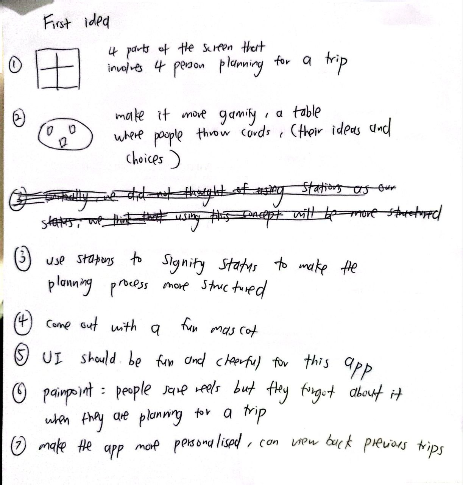
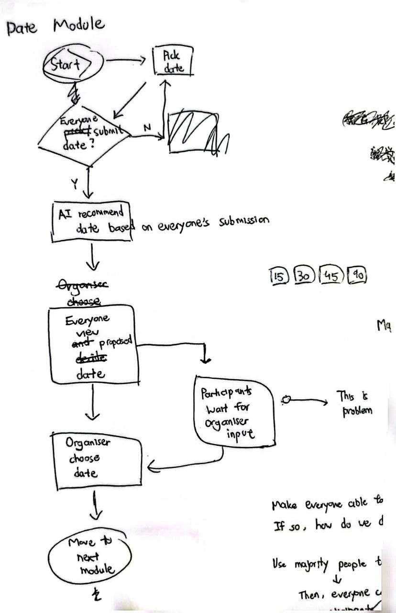
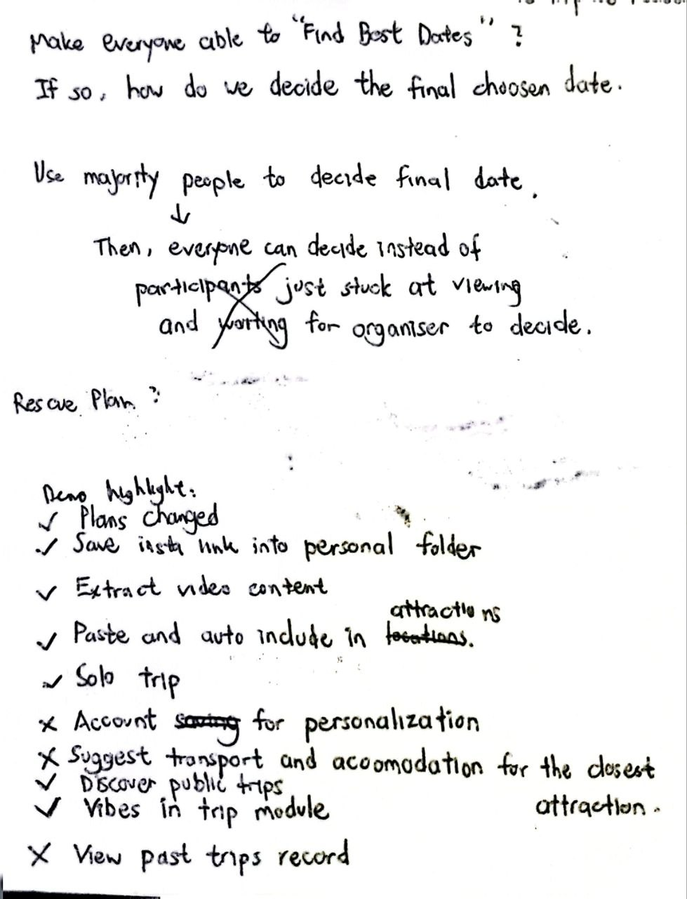
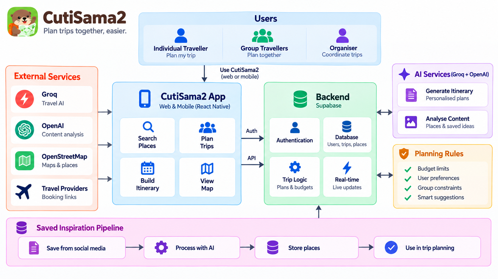

# CutiSama2 by Starstruck

**Team:** Brendan Chia Yan Fei, Neo Li Xin, Chew Chiu Xian  
**Problem Statement:** Travel Planner  
**Video Presentation:** To add — unlisted YouTube link  
**Presentation Slides:** [View the CutiSama2 pitch deck on Canva](https://canva.link/e0cj10tgzjpw03b)

## 1. Project Overview

### The Problem

Planning a trip involves more than finding attractive destinations. Friends must agree on dates, interests and spending limits, often across scattered messages and saved posts. One organiser ends up chasing replies and combining conflicting preferences, while travellers may feel uncomfortable revealing how much they can afford. Solo travellers face the same research and budgeting work without someone to share it.

Our target users are students, budget-conscious travellers and friend groups. The stakeholders are both the organiser coordinating decisions and the participants whose availability, interests and financial limits determine whether the plan works.

### Our Solution

CutiSama2 turns travel planning into a guided quest: agree on dates, set private budgets, choose countries, vote, explore places and arrange logistics. Everyone contributes through a shared process, while the organiser confirms key decisions. Solo mode removes group voting so independent travellers can plan directly. Personal profiles, favourite places, saved inspiration and trip history give travellers reasons to return for their next adventure.

| Feature | What travellers can do |
| --- | --- |
| Group planning quest | Submit availability, nominate countries and vote before the organiser confirms shared decisions. |
| Private budget ranges | Set comfortable spending and an absolute maximum in MYR without exposing individual amounts to the group. |
| Solo trips | Choose dates and a destination directly, without waiting for group submissions or votes. |
| Personalisation and favourites | Save a display name, profile picture and up to 30 favourite places. |
| Personal account settings | Start with an anonymous identity and access account settings to retain a personal travel identity. |
| Saved inspiration | Save travel posts, review extracted places and explicitly confirm locations to use in a trip. Media analysis requires its configured worker. |
| Maps and attraction choices | Explore destination attractions and contribute places to the shared plan. |
| Logistics and AI planning | Record transport, compare stays and generate a draft itinerary using the trip's constraints. Estimates are not live booking quotes. |
| Trips and memories | Reopen saved trips and access completed-trip memories from the profile. |
| Invitations and discovery | Invite friends and access public-trip discovery and listing controls. Joining is subject to trip eligibility and membership rules. |

Favourite places are currently saved profile data; this does not imply that every recommendation automatically uses them. Saved inspiration has a separate, explicit place-import flow.

### Competitive Market

| Alternative | Existing strengths | CutiSama2's intended focus |
| --- | --- | --- |
| [Wanderlog](https://wanderlog.com/) | Itinerary planning, maps, collaboration, budgeting and AI assistance. | Guided group agreement, private comfort/hard budget ranges and explicit voting rules. |
| [Mindtrip](https://mindtrip.ai/) | AI-generated itineraries, group collaboration, personalised recommendations and the ability to turn saved social or web inspiration into trip plans. | Use explicit decision rules and private affordability limits to balance the needs of the whole group before producing the itinerary. |
| [TRIPTI.ai](https://tripti.ai/) | Pre-booking group coordination through date scheduling, decision cards, reminders, shared itineraries and expense splitting. | Extend the guided agreement process across dates, destination voting and private comfort/maximum budgets, with affordability enforced as a shared constraint. |
| [Trip.com Trip.Planner](https://www.trip.com/tripplanner) | AI itinerary generation connected to real-time flights, trains, hotels, restaurants, attractions and an established booking ecosystem. | Help friend groups agree on when and where to travel, and what everyone can afford, before they reach the booking stage. |

Wanderlog already offers [budget tracking and expense splitting](https://wanderlog.com/travel-budget-expense-splitting-app), Mindtrip combines AI planning with collaborative inspiration, and TRIPTI.ai focuses directly on group coordination. Trip.com is an indirect competitor with a much stronger booking and live-inventory ecosystem. Therefore, “AI travel planner,” “collaboration” or “group budgeting” alone is not a convincing distinction.

CutiSama2's intended niche is **affordable group agreement before booking**: collect everyone's availability and private spending limits, apply transparent voting rules, and generate a plan within the group's shared constraints. The product hypothesis is that this process reduces organiser chasing and prevents a group from choosing a trip that some members cannot comfortably afford. This positioning still requires user testing and is not evidence that competitors lack similar capabilities or that travellers will switch.

## 2. Ideation & Process

### 2.1 Ideas We Considered

This table summarises the current implementation and directions raised by the judges. It is not a complete historical brainstorming record; the team should add any other original ideas before submission.

| Idea | Why it was dropped / kept |
| --- | --- |
| Guided group planning quest (Chosen) | Gives the organiser and participants a shared sequence of decisions. |
| Private budget ranges (Chosen) | Makes affordability part of planning without identifying the lowest-budget traveller. |
| Solo planning (Chosen) | Extends usefulness beyond group trips and skips unnecessary voting. |
| Profiles, favourite places and saved inspiration (Chosen) | Lets travellers keep personal ideas between trips. |
| Previous trips and memories (Chosen) | Supports returning users and continuity after a trip ends. |
| Invitations and public discovery (Chosen) | Supports existing friends and discoverable trips, subject to joining rules. |
| AI assistance with validated constraints (Chosen) | Helps with suggestions while keeping key decisions explainable. |
| Gemini specifically for budgeting (Suggested; not confirmed as selected) | The underlying need is useful cost estimates; provider choice is separate from user-controlled spending limits. |
| Automatic personalisation from all favourites (Future evaluation) | Saving favourites exists; broader recommendation integration needs explicit design and validation. |
| Card-game interface, with each card representing a travel idea (Dropped) | The card metaphor made the experience playful, but it limited how much information users could compare at once. Dates, budgets, destinations and logistics need clear forms and summaries, so using cards for every decision would add extra steps and make planning harder to scan. The guided quest concept kept the sense of progression without making every interaction behave like a card game. |
| Overcooked-style participant split screen combined with cards (Dropped) | Dividing the screen by participant would become crowded on mobile and would not scale well as the group size changed. It also implied that everyone had to participate at the same time, while CutiSama2 needs to support friends replying at different times and keep personal budgets private. A shared quest with individual submissions provides clearer progress without exposing each traveller's private input. |

### 2.2 Ideation Boards

The following boards document the team's ideation process and the development of the CutiSama2 concept.

#### Ideation 1

#### Ideation 2

#### Ideation 3

### 2.3 Mentor Consultation

The following feedback was discussed with Jeremy Lau Wei Han on 7 September 2026. Existing features are noted as responses to the feedback.

| Date | Mentor | Feedback Received | What Was Changed |
| --- | --- | --- | --- |
| 7 September 2026 | Jeremy Lau Wei Han | Add favourites, personalisation and accounts. | README now explains profile favourites, identity and saved inspiration, including the limits of automatic personalisation. |
| 7 September 2026 | Jeremy Lau Wei Han | Consider solo trips. | README now describes the existing solo flow and skipped voting steps. |
| 7 September 2026 | Jeremy Lau Wei Han | View previous trips; consider longevity and whether people will use it. | Added trips and memories, repeat-use rationale and a proposed validation plan. |
| 7 September 2026 | Jeremy Lau Wei Han | Allow friends and public joining. | Documented invitation and discovery features with eligibility constraints. |
| 7 September 2026 | Jeremy Lau Wei Han | Highlight the algorithm; consider Gemini for budget recommendations. | Added decision rules, an affordability example and the distinction between AI estimates and personal spending limits. |
| 7 September 2026 | Jeremy Lau Wei Han | Include competitive analysis and a clearer problem statement. | Added target stakeholders and a sourced comparison with Wanderlog. |
| 7 September 2026 | Jeremy Lau Wei Han | Too much text; avoid repetitive organiser/participant demonstrations. | Reorganised the README into compact tables and diagrams; added the single-journey demo below. Presentation changes remain to be made. |

## 3. Design & Prototype

**UI Prototype:** [View the CutiSama2 prototype on Canva](https://www.canva.com/design/DAHVEjjtaHw/5iotBNE3G4fXbxUN1TPgtQ/edit?ui=e30)

## 4. What Makes It Different

CutiSama2 combines structured group decision-making with personal travel continuity. Its distinctive features are:

| Feature | What makes it different |
| --- | --- |
| Reels to saved places | Travellers can save a public Instagram Reel or TikTok, let CutiSama2 extract the places mentioned or shown, review the results, and confirm selected locations for a future trip. This turns travel inspiration into usable planning data instead of leaving it buried in social media bookmarks. |
| Personal travel passport | Profiles, favourite places, saved inspiration, previous trips and memories make the product useful between trips. |
| Private comfort and maximum budgets | Participants contribute real limits without exposing individual amounts. The group plan uses the lowest comfort and maximum ceilings so the itinerary remains affordable for everyone. |
| AI within validated rules | AI ranks or estimates options, while deterministic checks enforce dates, budgets, destination constraints and privacy. |
| Guided planning quest | Dates, budgets, destinations, attractions and logistics are completed as clear stages. This reduces organiser chasing and makes progress visible. |

Compared with general itinerary tools, the twist is that CutiSama2 makes agreement and affordability first-class decisions before generating a plan.

## 5. Technical Architecture & Feasibility

### Tech stack

| Layer | Technology | Why it was chosen and expected constraints |
| --- | --- | --- |
| Frontend | Expo SDK 57, Expo Router, React Native, TypeScript | One codebase for mobile and web with typed navigation and shared components. Native-device testing and platform-specific behaviour remain constraints. |
| Backend | Supabase Auth, Edge Functions and RPC/database functions | Managed authentication and server-side workflows reduce infrastructure work. Function cold starts, deployment configuration and provider limits remain constraints. |
| Database | Supabase PostgreSQL with Row Level Security and Realtime | Relational trip state, private participant inputs and secure per-user access fit the data model. Realtime is used for notifications; clients still refetch authorised state. |
| Validation | Zod contracts and deterministic domain rules | Keeps mobile and server payloads aligned and prevents malformed or contradictory generated plans from being stored. Contracts must be updated across app and functions together. |
| AI services | Configured Groq/OpenAI-compatible planning provider and OpenAI saved-inspiration analysis | AI assists with ranking, estimates and media extraction while server-side secrets stay private. Provider latency, cost, rate limits and imperfect estimates require fallbacks and validation. |
| Maps | OpenStreetMap raster tiles | No additional map API key is required for the prototype. Tile usage must follow the OpenStreetMap policy and fresh imagery needs a network connection. |
| Testing | Jest, React Native Testing Library, pgTAP, Deno and Maestro | Covers app logic, contracts, database rules, Edge Functions and user flows. Live provider, realtime and native-device behaviour still need deployment testing. |
| Hosting | Expo-compatible build/runtime and a hosted Supabase project | Keeps the prototype deployable with managed services. Production hosting, secrets, quotas and release configuration must be maintained separately. |

### System architecture diagram

The diagram shows the main request and data flow. Deterministic rules protect privacy and trip constraints while AI assists with ranking, estimates and media analysis.

### Build plan & scope

The build phase focuses on a demonstrable end-to-end path:

1. Create or enter a trip as a solo traveller or group organiser.
2. Collect availability and private comfort/maximum budgets.
3. Select and vote on destinations, then explore attractions on the map.
4. Add transport and accommodation estimates and review the remaining budget.
5. Generate a constrained draft itinerary and show its assumptions clearly.
6. Save the trip, reopen it from trip history and show favourite places or saved inspiration.

The scope excludes live booking, payment processing, guaranteed prices, turn-by-turn navigation and a full social network. Booking links open external providers. These boundaries keep the prototype feasible while demonstrating the core value: helping travellers reach an affordable, explainable plan together.
