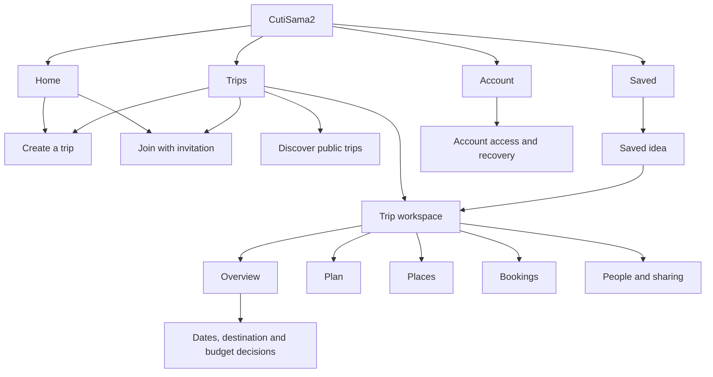

# CutiSama2: detailed experience redesign

Design specification, 10 September 2026. Companion: [Evidence and critical audit](./product-ux-audit.md).

This describes the target experience, not shipped functionality. Illustrative screen content is fictional. No app code changes are included. Proposed backend capabilities are explicitly called out so implementation cannot silently substitute visual controls for real behaviour.

## Experience contract

CutiSama2 helps you make a travel plan with the people going on it. At any point, a traveller should understand the current destination/date status, their next useful action, what others still need to decide, and where the itinerary lives.

Assume a Malaysia-first, MYR-first launch with English initially and layouts ready for Bahasa Malaysia. These assumptions follow the existing content and contracts; they are not validated market research. Keep solo planning first-class. Do not assume every trip is international, every group flies from the same city, or everyone can contribute at the same time.

## Information architecture

Use four global tabs: **Home · Trips · Saved · Account**. Create is a contextual action, not a tab. Preserve the selected tab, scroll position, and nested navigation state when switching. Every root has an understandable empty state. Global tabs remain stable on standard pages; focused modal editors sit above that shell with Back/Cancel and Save. Never display two bottom navigation bars.



The trip has four local sections under its header: Overview, Plan, Places, Bookings. People is a labelled header action. Budget is a summary on Overview opening a detail screen. Decisions open from Overview and remain revisitable after completion. The local section row can scroll at large text sizes; it must not shrink labels or replace global navigation.

Keep existing deep links working through a route adapter. A legacy lobby link should resolve to the appropriate trip overview, and an old stage link to its decision. An invalid or inaccessible trip shows a recoverable error with Trips and invitation options. Existing permissions still apply.

## Core flows

### Create and first value

Home → Create a trip → short setup → trip Overview. Default name “Untitled trip”, editable. Ask “Who is going?” with “Just me” and “With others”, and “Destination” with search or “Decide later”. Dates are optional with “Not decided”. Keep optional preferences out of this first form. CTA: **Create trip**. Show progress during creation, prevent duplicates, preserve fields on error, and navigate only after a successful response.

Destination search must distinguish supported catalogue options from unverified manual places. Do not produce false details for a manual entry. A destination supplied by an inspiration card is prefilled, never silently discarded. The shared creation shell can call different solo/group services until those APIs are consolidated.

On Overview, offer **Add a place** and, for groups, **Invite people**. Creating a useful draft must not require sending invitations. After the first successful save, offer “Keep your trips across devices” as a dismissible account-linking prompt. No account promise may exceed actual recovery behaviour.

**Dependency:** optional dates, manual destination support in the active planning path, and immediate workspace access require contract and server work. In the interim, simplify the existing form but state required inputs honestly.

### Join and contribute

Invitation → trip preview → display name → **Join trip** → Overview with “Your next step”. Preview shows trip name, organiser, available dates/destination, and visibility. Avoid revealing private budget or unavailable-date data. Expired/revoked links explain what happened and how to request a replacement; full trips give an explicit capacity message. A successful join must not lead to a readiness waiting room.

Late joiners see confirmed decisions and contribute to open ones. They do not silently reopen a completed vote or change its denominator. If the existing eight-person capacity remains, show it when inviting and enforce it on the server.

### Make a shared decision asynchronously

Overview → Dates, Destination, or Budget → enter or compare → **Save my response** → acknowledgement and response summary. Users can then return to their itinerary or another open decision. No response never counts as approval or rejection.

An organiser may create a **provisional draft** from available inputs. Final confirmation requires all required participants to respond or explicitly delegate/abstain under a disclosed rule. Organisers cannot mark another person as having agreed. A missing response can remain a blocker for final confirmation without blocking unrelated planning. A submitted hard constraint cannot be overridden by a majority vote.

Reopening a decision creates a new version. Show affected dates, bookings, and itinerary items before committing. Preserve the previous confirmed version and surface “Needs review” on dependent content. Reminders are optional, addressed to outstanding participants, and never sent simply because the screen loads.

### Save inspiration and use it

Saved → Add link → paste URL → **Save link** → saved source immediately → background extraction → review places → **Add to trip**. Default collection is “Travel ideas”. Optional folder and caption fields are secondary. The saved source remains available if analysis fails.

An extracted place is a suggestion until reviewed. Show name, locality, source, and ambiguous matches. A multi-place post allows individual selection. If the post cannot be read, offer manual place entry or optional text. Never imply that every reel is automatically transcribed. Explain external AI processing beside the analysis action using the real service's behaviour.

When adding to a trip, distinguish **Saved for this trip** from **Scheduled in the itinerary**. Preserve source provenance; detect duplicate place identities. A place outside the chosen destination prompts a clear choice to keep as an unscheduled idea or change the trip, rather than silently changing country.

### Plan and travel

Open trip → Plan → day selector → readable timeline. Show actual booked travel first where applicable, then activities and travel gaps. “Add activity” opens search/manual entry; “Build a draft” is available once minimum inputs exist, with missing assumptions explained. Generation preserves the previous plan until a replacement succeeds. Review changes before replacing an existing version.

During the trip, default to today when the trip dates and local time zone support it. Offer a day list, map view, and directions handoff. Offline access must clearly distinguish cached itinerary content from unavailable maps or live prices; a cached JSON plan is not a guarantee of offline map availability.

## Screen specifications

| Screen | Hierarchy and main action | Required behaviour |
| --- | --- | --- |
| Home, new user | Small brand header; “Plan a trip, together”; one Create CTA; Join link; compact destination inspiration. | Core actions appear before lengthy content at ordinary text size. No forced tutorial, unsupported ranking, or inactive destination cards. |
| Home, returning | “Continue planning”; latest relevant trip summary; one next task; Create/Join secondary; inspiration below. | Resumption includes the trip name and actual status. Failure to load a recent trip must not block creation or other navigation. |
| Trips | Title + Create; Current/Past filters; vertical list; Join and Discover secondary. | Each row shows name, known destination/dates, and factual status. Entire row opens the trip; overflow holds administrative actions. Search appears when useful for the collection size. |
| Overview | Trip title + People; destination/dates; next action; compact decisions; budget summary; recent material changes. | Separate “Your response saved” from “Decision confirmed”. Put one next task above optional summaries. No duplicated roster, avatar parade, or flight-track decoration. |
| Dates | “When can you travel?”; date mode; range; optional flexibility; Save response. | Range picker with spoken full dates; exact/flexible status; unavailable dates behind an optional section. Same-day trips and unsupported durations get explicit rules. Never silently alter trip length. |
| Destination decision | Constraints summary; shortlist rows; detail/comparison; response action. | Show estimated affordability and source state where available. Explicit choices beat mandatory swipe gestures. Optional swiping may supplement buttons. Keep country versus city scope clear. |
| Budget | Currency + per-person/whole-trip basis; amount; included items; response state. | Collect early if known. Separate personal maximum from estimated cost and selected bookings. Explain the group ceiling and incomplete responses. Individual amounts stay private unless explicitly shared. |
| Places | Search/Add; Saved/Scheduled filters; List/Map toggle; place rows. | List is fully usable without the map. Selection does not imply scheduling. Map state survives switching views. Avoid gesture capture that traps vertical scrolling. |
| Plan | Compact trip header; day selector; draft status; timeline; Add activity. | Times and place names are primary. Costs, transport gaps, and unresolved assumptions are visible. Move up/down/day actions provide alternatives to dragging. |
| Bookings | Transport and stays; selected/booked/missing state; Add booking. | Separate a suggested option from a booking confirmation. Show traveller, provider, dates, price basis, and relevant local time zones. Opening an external provider does not mark an item booked. |
| Saved | Search; collection filters; saved rows; Add link. | Intake is a focused editor. Ready, processing, needs review, failed, and no-result states are distinguishable. Retry analysis never duplicates the original saved link. |
| Account | Identity summary; Keep trips across devices; preferences; help; privacy; sign-in/out. | Editing profile is separate from switching accounts. Existing account sign-in discloses that guest trips do not merge; preserve recovery options. Referrals and badges are secondary. |

### Two reference wireframes

These specify order and intent, not pixel-perfect compositions. The six travellers and amounts are illustrative.

```text
TRIP OVERVIEW                         PLAN
‹ Trips           Penang weekend     ‹ Trips           Penang weekend
                  People (6)                           People (6)
Overview  Plan  Places  Bookings      Overview  Plan  Places  Bookings

George Town                          Fri 16   Sat 17   Sun 18
16–18 Oct · Dates confirmed           Saturday, 17 October
                                     Draft · 2 details need review
Your next step
Choose the places you want to visit  09:00  Breakfast at the market
[Choose places]                      Address and useful note
                                     Cost estimate · Source
Decisions                            15 min walk · estimated
Dates           Confirmed       ›
Destination     Confirmed       ›    10:15  Heritage walk
Places          4 of 6 responded›    Opening hours not checked
Budget          Add your limit  ›    [View details]

Trip budget                          [+ Add activity]
Estimate not available yet
                                     Home   Trips   Saved   Account
Home   Trips   Saved   Account
```

At large text sizes these rows grow and the page scrolls. There is no requirement to squeeze every pictured element above the fold. On small phones the next useful action should remain prominent without shrinking its text.

## Visual and component system

Use warm off-white surfaces, dark neutral text, and the existing deep green for primary action. Retain small otter/ochre accents in expressive moments. Operational screens should have flat rows, quiet dividers, and clearly grouped content; reserve elevated cards for selectable options or status summaries. No texture overlays, decorative glass, giant branding, or continuous motion on working screens.

| Token or component | Target specification |
| --- | --- |
| Typography | System font; title 28/34, section heading 20/26, body 16/24, support 14/20, tab label 12/16 at default scale. Numbers use tabular figures where supported. All scale with OS settings. |
| Text colours | Primary `#263128`, secondary `#566052`, inverse white. Proposed tokens require rendered state verification before adoption. Existing white/deep-green pairing is already viable by calculation. |
| Surfaces | Background `#FAFAF6`, surface white, selected tint `#EDF4DB`, primary action `#4F7027`. Error and warning receive semantic roles and text/icons, not colour alone. |
| Spacing | 4-unit base; 16–20 horizontal screen padding; 8–12 within a group; 24–32 between sections. Use available width rather than fixed device dimensions. |
| Controls | At least 48 × 48 logical units effective target; primary buttons minimum 52 high and grow with wrapping. Icons 20–24 inside padded targets. No adjacent overlapping hit areas. |
| Shape | Inputs/buttons about 12 radius, larger cards 16; fully rounded shape only for avatars and appropriate compact chips. One clear selection treatment. |
| Button | Primary, secondary, text, destructive; visible press/focus; disabled with reason nearby. Loading retains its accessible name and uses busy state. Label may say “Saving…” without layout collapse. |
| Field | Persistent label, optional hint, appropriate keyboard, inline error linked to the input, visible focus. Do not rely on placeholders or colour to identify a field. |
| Status | Plain-language state + icon where helpful: Saved, Waiting for responses, Draft, Confirmed, Needs review, Offline. Live announcements only for meaningful changes. |
| Motion | Short transitions around 150–250 ms when useful; reduced motion removes nonessential movement. No animation delays before controls become usable. |
| Safe areas | One owner per inset. Header owns the top edge on headed routes, tab shell owns bottom navigation; editor owns its keyboard/footer inset. Verify Android back and gesture navigation. |

The size scale and token values are proposed design decisions, not claims that a guideline mandates those exact numbers. Native accessibility guidance and contrast thresholds are linked in the audit. A web layout check cannot replace native font-scaling and assistive-technology testing.

## Decision and collaboration rules

Replace the single global stage as the UI's organising model with versioned decision records. Suggested states: **Not started → Collecting → Ready to confirm → Confirmed**, with **Needs review** after a dependent change. A provisional itinerary is a separate artefact state; it is never evidence of group consensus.

Each decision needs a version, required participant set, individual response status, confirmation actor/time, and explicit dependency references. Existing revisions, operation keys, and authority checks should be reused where compatible. Never resolve simultaneous writes by silently replacing a person's unsaved response.

| Event | Required outcome |
| --- | --- |
| Someone has not responded | Show actual count and missing response; allow unrelated work and a labelled provisional draft. |
| Participant abstains/delegates | Record explicit intent. Do not treat absence as abstention. Explain whose decision authority applies. |
| Someone joins after confirmation | Show the confirmed version; include them in future open decisions. Any reopening is explicit. |
| Date/budget/destination changes | Preview affected plan/booking items, create a new decision version, preserve history, flag impacted content. |
| Tie or no acceptable option | Explain result and offer revise shortlist or agreed organiser resolution. Do not fabricate a winner. |
| Budget or availability conflict | Explain that no feasible shared option exists; ask for revised inputs. Never expose another person's private reason or lowest amount. |
| Member removed | Explain immediate access loss and effect on open decisions before confirmation. Recompute against an explicit participant version. |

**Privacy dependency:** proposed private budget controls require response filtering and database policy verification. Client-side hiding is insufficient. The aggregate minimum may allow inference in small groups; do not promise that it is mathematically anonymous.

## Reliability and recovery states

| Condition | Interface response |
| --- | --- |
| Initial load | Layout-matched placeholder or concise loading state with an accessible announcement; never render empty-state copy before load completes. |
| Refresh failure with existing data | Keep content, mark it out of date, offer Retry. Show last successful update when known. |
| Save pending | Preserve input, prevent duplicate submissions, keep a stable labelled control. |
| Save failed | “Your changes weren’t saved. Try again.” Keep draft and context. Never show success based only on a tap. |
| Concurrent update | “This decision changed while you were editing.” Show latest and retain local draft for review before resubmission. |
| Offline | Show cached content and its age. Initially disable server-dependent confirmation. Claim queued saving only after durable queue, retry, and conflict handling exist. |
| No trips | “Your trips will appear here.” Create primary, Join secondary. |
| No search matches | Preserve search/filter input; offer Clear filters; distinguish from an empty collection. |
| Analysis/generation slow | Explain current state and allow leaving safely. Reopening restores the operation; retry uses idempotency. |
| Identity/access lost | “We can’t access this trip on this device.” Offer valid sign-in or invitation recovery paths; do not silently create a duplicate membership. |
| Destructive edit | Confirm consequences for removal, account switching, and replacing a confirmed plan; ordinary field saves require no extra confirmation. |

## Copy rules

| Existing language | Target language |
| --- | --- |
| Trip Room / Trip Lobby | Trip / Trip overview |
| Start your quest | Start planning |
| Chapter / flight stop | Decision or task name |
| Play your wishlist / fresh deck | Suggest destinations / Edit shortlist |
| Swipe to decide | Choose where you’d like to go |
| Destination unlocked | Destination confirmed |
| Everyone’s comfort zone | Group budget limit |
| Logistics | Transport and stays, or Bookings as the section label |
| Draft confidence 87% | Specific checks needed on the affected items |
| Secure guest session created in background | Start without signing up |

Use British/Malaysian English consistently, sentence case, explicit verbs, and useful errors. Price labels must state MYR/RM, per-person versus group, and whole-trip versus per-night basis. Show date ranges with an unambiguous month name; travel times need destination/provider time-zone context when crossing zones. Do not hard-code English text widths.

## Technical delivery boundaries

The exact [Expo SDK 57 reference](https://docs.expo.dev/versions/v57.0.0/) was reviewed as required by the repository instructions. The package manifest already uses Expo 57, React Native 0.86, and React 19.2. No framework migration is proposed. Read relevant versioned routing and component documentation again at implementation time.

| Phase | Deliverable | Dependencies and acceptance |
| --- | --- | --- |
| 1: usability defects | Contrast/type repairs; remove misleading controls and duplicate navigation; accessible loading labels; accurate content claims. | Mostly client work. Core route regression checks, measured colour checks, native large-text and focus review. |
| 2: simpler entry and retrieval | Home/resumption, Trips list, Saved collection-first layout, concise creation, account-linking entry. | Existing services largely reusable; new trip summary fields may need a query change. Retain old deep links and clear restrictions. |
| 3: shared workspace | Independent decisions, provisional planning, late joining, explicit reopening and participant rules. | Contracts, RPCs, permissions, migrations, revision dependencies, and concurrency tests. Do not remove frontend locks ahead of server support. |
| 4: richer travel assistance | Constraint-aware comparisons, reliable reminders, improved provider handoffs and offline support. | Data provenance, notification consent/delivery, map/provider capability, durable cache/queue where promised. No speculative price claims. |

Keep old trips interpretable during migration. Map the existing quest stage into known decision statuses and preserve the current itinerary. Do not synthesise individual consent from aggregate completion. Use a versioned rollout and retain a rollback path for old contracts. Test organiser/member permissions, rejoin, removal, simultaneous votes, stale recommendation invalidation, and idempotent generation before enabling new state transitions.

## Acceptance and research plan

Run moderated sessions with 6–8 participants spanning first-time organisers, invited members, solo travellers, returning planners, and assistive-technology users; recruit additional accessibility specialists if needed rather than assuming a small sample establishes compliance. Test actual tasks, not opinions about screenshots. Invitees should receive a realistic deep link instead of starting artificially on Home.

Proposed directional targets, to be calibrated against the baseline: at least 80% unassisted success per core task in formative rounds; a saved trip draft within 60 seconds of starting creation; returning to a known trip within 15 seconds; participants correctly distinguishing a saved response from confirmed group agreement. These are design targets, not measured results or statistically representative claims.

Instrument creation start/success/failure, invitation acceptance, first useful saved input, time waiting on decisions, response revision, first itinerary opened, analysis failure/retry, and recovery success. Avoid logging private unavailable dates, personal budgets, invitation tokens, or raw imported content in analytics. Compare comparable organiser/member cohorts and exclude service outages when interpreting usability changes.

Before release, verify:

- 320–430 logical-unit phone widths, landscape, notches, gesture areas, keyboard open, and large OS text settings without clipped actions or essential text.
- VoiceOver and TalkBack names, roles, values, selected states, error association, focus restoration, and non-gesture alternatives.
- Normal text contrast of at least 4.5:1, applicable large text and meaningful non-text contrast of at least 3:1, and effective touch bounds.
- Every displayed interactive control has a meaningful result; no duplicate bars, dead plus icons, or unsupported “popular” labels.
- First-time, empty, full, failed, stale, offline, account-switch, and expired-link states are understandable and recoverable.
- An absent traveller cannot prevent unrelated planning; no missing response is represented as agreement.
- A source post survives extraction failure, and a last good itinerary survives regeneration failure.
- Estimates, selected options, and actual bookings are visibly distinct, with currency and cost basis shown.

The target release is a dependable planning tool: people can find their trip, understand its status, contribute on their own schedule, and use the plan while travelling. Visual polish is successful only when those tasks are easier.
